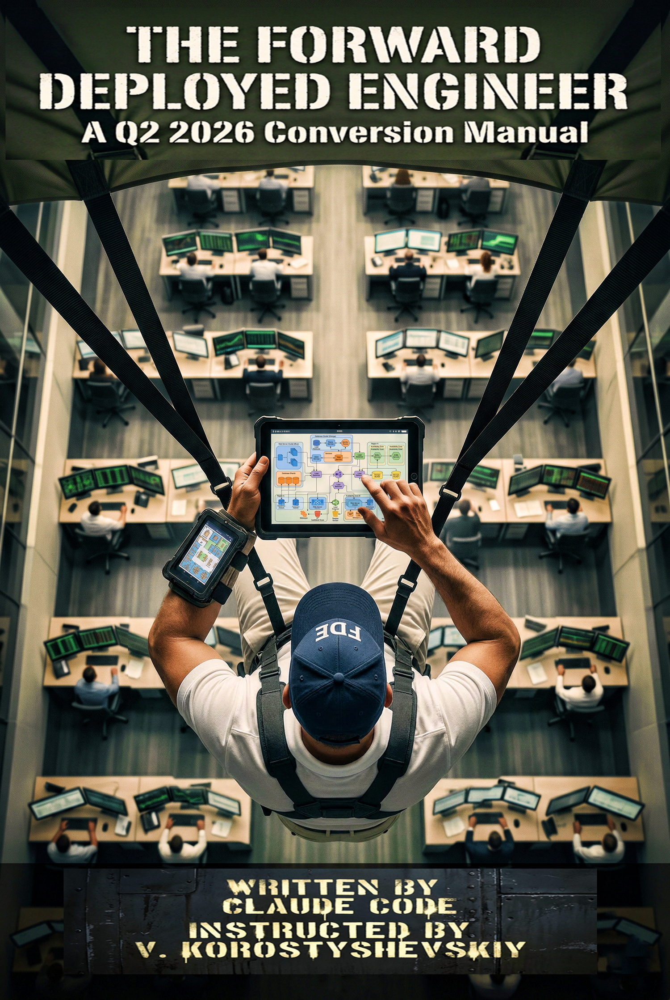

# The Forward Deployed Engineer: A Q2 2026 Conversion Manual

A conversion manual for people considering a move into the Forward Deployed Engineer role or just curious what it is and how it works. Ten chapters drawn from earnings call transcripts, workforce transformation announcements, job listings, YouTube interviews and podcasts with working FDEs, compensation analyses, and independent research reports. The book traces the role from its Palantir origins through its Q2 2026 proliferation, names the labor-market cycle driving it, describes what the work actually is week to week, weighs whether the role is inflating toward commodity status, maps three familiar corporate roles to the FDE conversion path, and covers the skill stack, interview architecture, employer landscape, and career trajectories.

[Video overview of the project](https://www.youtube.com/watch?v=AJu9wOMmkhM)

## Why "Q2 2026"

The date in the title is deliberate. The FDE role is changing fast, and a lot of what this book reports is tied to a specific moment: which companies are hiring, what they pay, how the title is used, and what the interviews look like. Those details are grounded in dated public sources, and they will go out of date. What is meant to last is the underlying analysis: how a role like this tends to appear, get hyped, and then become ordinary once more people can do it. The specifics are a snapshot; the pattern is not. Chapter 3 takes this up directly and is honest about which of the book's claims have a shelf life and which do not.

## Why this exists

I wanted to understand the Forward Deployed Engineer role: what it actually requires, how it differs from roles I already knew, and whether the recruiting rhetoric matched the operational reality. The fastest way to close the gap was to build a research corpus from every public source I could find and have Claude synthesize it under explicit instructions. I did this for myself, to develop a structured understanding of a role proliferating faster than any single practitioner can track linearly. After reading what came out, I figured other practitioners might find it useful, and put it here.

## How it was made

I used [YTubeFetch](https://github.com/vkorost/ytubefetch), my own free subtitle download app, to pull subtitles from YouTube videos: FDE interviews, podcasts, day-in-the-life vlogs, career advice, and company announcements, preserving each video's title, description, and publication date.

To these I added independently produced research reports synthesized by Claude, Gemini, and Perplexity from public sources: the labor-market hype-cycle thesis, role taxonomies, Salesforce's FDE buildout, the prep economy, compensation analyses, and role-mapping dossiers for each conversion path.

The book itself was assembled with Claude using techniques described in [weekend-diy-book](https://github.com/vkorost/weekend-diy-book): style condensation, per-chapter assembly under explicit instructions, dedup, review, edit, revision, and final DOCX/PDF/EPUB generation, orchestrated as a multi-phase pipeline with sequential sub-agents.

## The Ten Chapters

1. [**The Myth**](./book/chapters/01-the-myth.md): the marketing version of the FDE role, traced from Palantir through Salesforce's 2025-2026 buildout. Introduces The Cycle, The Navy SEAL Fallacy, and The Snapshot Manual as the book's load-bearing framings.
2. [**The Job**](./book/chapters/02-the-job.md): what an FDE actually does in a week. Time allocation, deliverables, failure modes, on-site and remote balance. Closes the perception gap before the reader invests in conversion chapters.
3. [**The Inflation Question**](./book/chapters/03-the-inflation-question.md): will FDE become the next full stack? The hype-cycle trajectory thesis applied to the role's current arc. The Snapshot Manual concept made structural.
4. [**Software Developers to FDE**](./book/chapters/04-software-developers-to-fde.md): what transfers (The Production Muscle), what needs re-learning (The Pre-Scoped Ticket), and the honest conversion path (The Reframe Test).
5. [**Project Managers to FDE**](./book/chapters/05-project-managers-to-fde.md): what transfers (Cross-Functional Fluency), what is new acquisition (The Production-Code Floor), and the honest conversion path (The Rebuild, Not the Refresh).
6. [**Engineering Managers to FDE**](./book/chapters/06-engineering-managers-to-fde.md): what transfers (Executive Fluency), what needs recovery (The Withered Muscle), and the identity recalibration required (The Leverage Inversion).
7. [**The Skill Stack**](./book/chapters/07-the-skill-stack.md): technical baseline (full stack, data pipelines, prompt orchestration, retrieval, evals, agent frameworks) and non-technical skills (scoping, executive translation, composure under live failure).
8. [**The Interview**](./book/chapters/08-the-interview.md): the FDE interview architecture by employer tier. Take-homes, decomposition rounds, applied coding, customer simulations, and what each round actually tests.
9. [**Where the Jobs Are**](./book/chapters/09-where-the-jobs-are.md): employer tiers, title variants to search for, compensation by tier, and the heuristic for distinguishing a real FDE listing from a services-engineer rebrand.
10. [**Trajectories**](./book/chapters/10-trajectories.md): where senior FDEs go. Product, founding, staying technical, exiting to a customer, returning to core engineering.

## What's in this repo

- `README.md`: this file.
- `LICENSE`: full license terms (see License below).
- [`book/The_Forward_Deployed_Engineer.pdf`](./book/The_Forward_Deployed_Engineer.pdf): PDF for offline reading and print.
- [`book/The_Forward_Deployed_Engineer.epub`](./book/The_Forward_Deployed_Engineer.epub): EPUB for e-readers.
- `book/chapters/`: the ten chapters as individual Markdown files.
- `book/FDE-Cover.jpg`: cover image.

## Coverage cutoff

YouTube transcripts, earnings calls, job listings, and research reports consulted through Q2 2026 are reflected in the corpus. The field is fluid and companies have moved since. Chapter 3's Snapshot Manual assessment identifies the assumptions most likely to require re-verification as the Cycle progresses.

## Scope of AI assistance

Claude was used for research synthesis, prose generation, per-chapter assembly under explicit instructions, and final formatting. The multi-agent pipeline ran sequentially: a Style Agent, a Grounding Agent, a Registry Agent, per-chapter Writer Agents, Fact-Trace Agents, an Endnotes Compiler, a Dedup Agent, two Reviewer Agents, and an Editor Agent. Editorial decisions about which positions to include were mine.

Several of these stages existed specifically to limit hallucination and generic AI filler. The Grounding Agent built the source base first, and the Writer Agents drafted against that corpus rather than from open-ended generation. The Fact-Trace Agents then tied each substantive claim back to a specific source; claims that could not be traced were dropped rather than kept on plausibility, and claims with thin support were softened rather than stated flatly. The Registry Agent enforced anti-repetition so the same point and phrasing did not recur across chapters, and the Dedup Agent removed what remained. The two Reviewer Agents read each chapter against the standard of saying something a default AI prompt on the same sources would not, flagging hedged, generic, or filler passages for rewrite. None of this makes the book infallible. What it does is keep every claim traceable to the cited public corpus: rather than independent fact-checking, the book is grounded in that corpus, and a reader can verify any claim against its source.

## What's not in scope

This is not a getting-started guide for new graduates. It is not a bootcamp curriculum. It is not a vendor comparison of FDE employers. It is not a resume template or a LinkedIn optimization guide. The reader is assumed to know what production code is, what a deployment pipeline is, and what it means to be on call.

## Author

I am not employed by Palantir, Salesforce, OpenAI, Anthropic, or any company whose FDE program is discussed. The book was produced independently and does not represent any company's views. The analytical framework, the named patterns, and the structural argument are original to this work. The facts are drawn from the cited public corpus.

## License

This book is released under [Creative Commons Attribution 4.0 International (CC BY 4.0)](https://creativecommons.org/licenses/by/4.0/). See [LICENSE](./LICENSE) for full terms and disclaimers.

---

